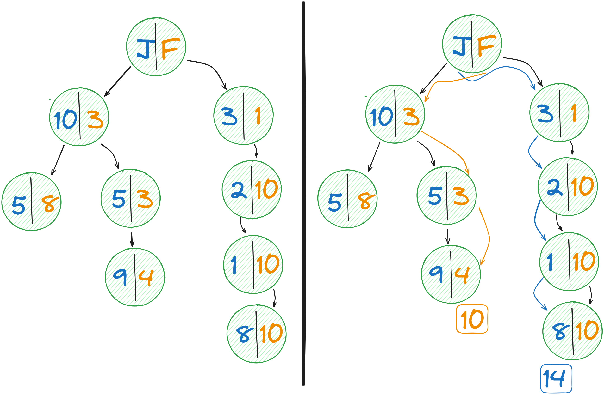
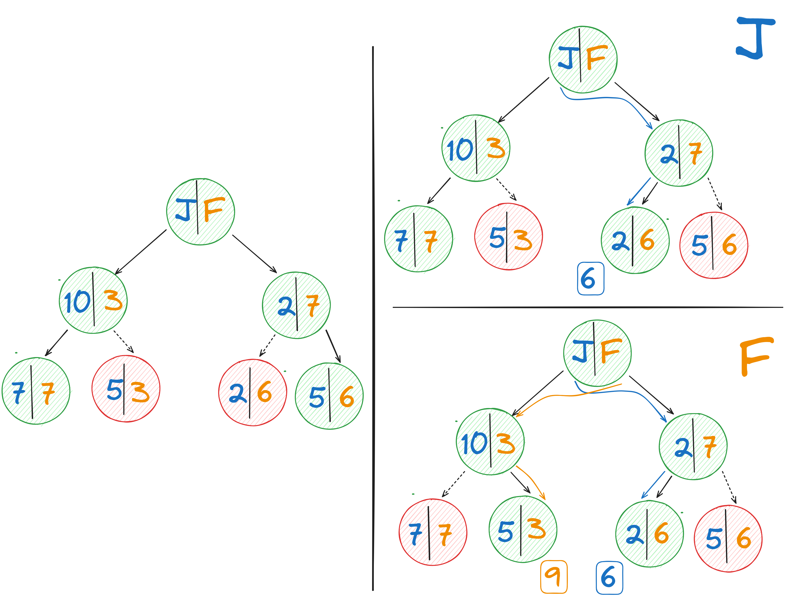
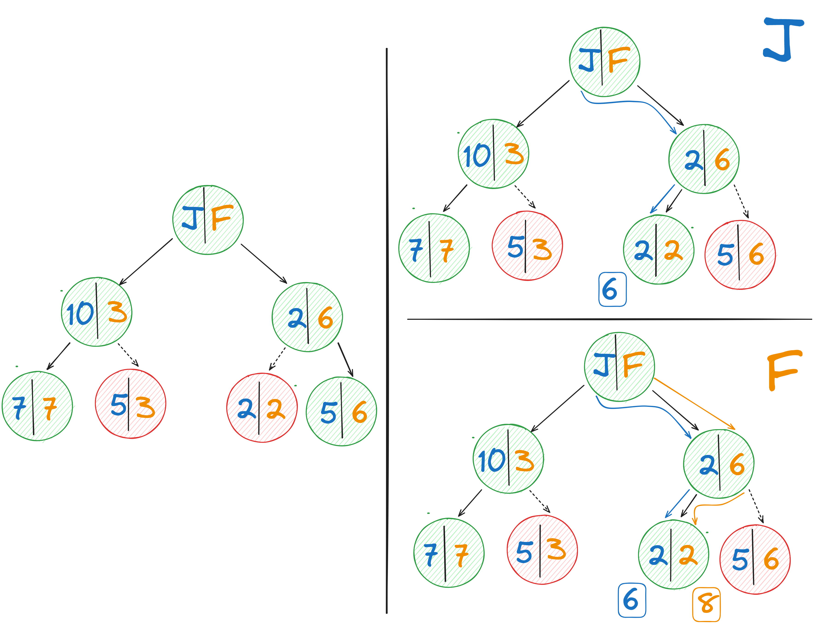
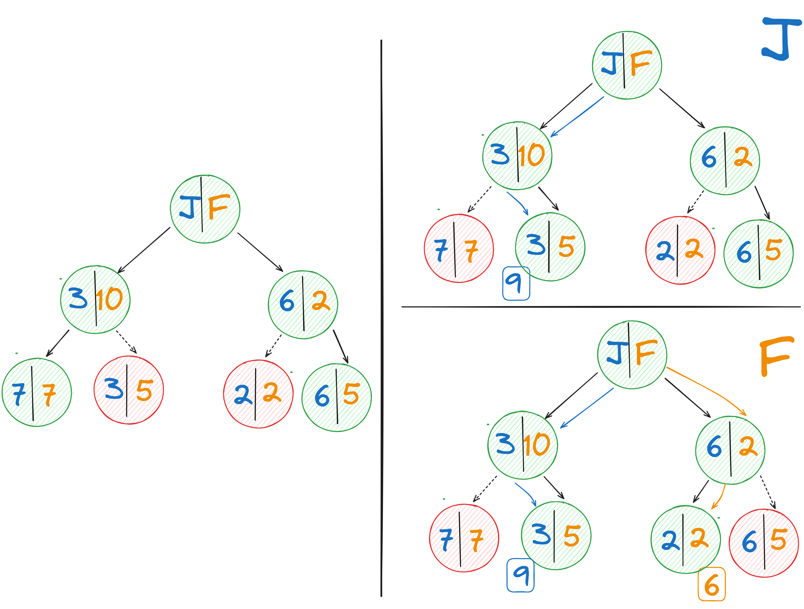
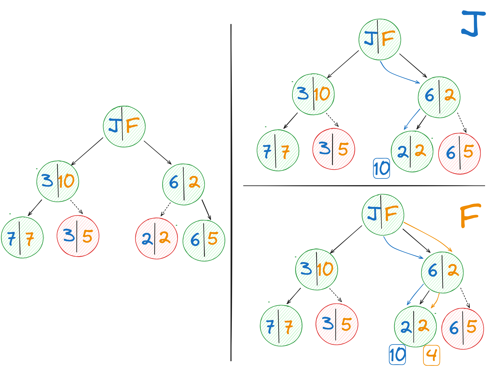

# Buscando Caminos


> **Nota** Recuerde descomprimir la prueba antes de comenzar a trabajar. Si programa dentro del comprimido es posible que pierda su solución sin posibilidad de reclamar. 

Javi la Habichuela y Frank el Frijol  son estudiantes de la Escuela de Magia para Alimentos (E.M.A). Después de una aventura fallida en el Huerto Prohibido necesitan regresar rápidamente a la E.M.A pero debido a la desesperación y al apuro tomaron el camino érroneo de vuelta. Ahora entre la escuela y ellos se interpone un gran acantilado! Por suerte para ellos es un acantilado mágico y se encuentran varios islotes de tierra flotando sobre este. Algunos de estos islotes se comunican entre si a través de distintos puentes viejos. Ellos creen que pueden cruzar satisfactoriamente el acantilado auxiliándose de estos islotes, no obstante, necesitan cruzarlo también de la mejor manera posible. Ayuda a Javi y a Frank a encontrar el mejor camino hacia la E.M.A.


## El Problema

Tras una inspección pausada sobre las características del acantilado mágico y las habilidades de nuestros protagonistas se puede concluir lo siguiente:

1. **Los islotes tienen forma arbórea**: La forma de los islotes es un árbol con Javi y Frank situados en la raíz de este. Llegar a cualquier islote hoja significa cruzar satisfactoriamente el acantilado.

2. **No siempre hay puentes**: Javi y Frank solo pueden moverse de un islote padre a un islote hijo si existe un puente entre estos. Existen islotes hijos para los cuales ya no hay ningún puente. Un islote hijo sin puente, sigue siendo considerado como un nodo hijo de su padre.

3. **Es posible reconectar puentes**: Javi y Frank no asisten a la E.M.A por placer, ambos cuentan con una varita mágica que les permite intercambiar el puente del islote padre a un islote hijo por un puente entre el islote padre y otro islote hijo.

4. **Costo de cruzar un puente**: Cruzar un puente conlleva un esfuerzo que se traduce en un costo asociado. Este costo asociado difiere según el protagonistas cruzando el puente: un mismo puente puede ser más fácil para Javi que para Frank y viceversa. El costo siempre será positivo y menor que 100.

5. **Costo de intercambiar un puente**: En caso de usar su varita mágica y cambiar la posción de un puente por otro, se tiene el mismo costo como si ese personaje cruzara por ese puente.

5. **Solo un alimento puede cruzar el acantilado a la vez**: Debido a fuerzas mágicas incomprensibles, solo uno de los dos puede estar cruzando el acantilado, en caso de ser los dos, ocurrirá un mini cataclismo.

6. **Javi siempre cruzará primero**: Javi siempre ha sido el mas valiente de los dos y por tanto tomará la delantera.

Conociendo esto, diseña un algoritmo que dado la topología de los islotes en el acantilado retorne el menor costo de cruce entre Javi y Frank.

## El Programa

Debes escribir la respuesta a este problema en el archivo _Solution/Solution.cs_. En _Solution.cs_ se encuentra la función `CostoDeEscape` dentro de la cual debe escribir su lógica o cualquier llamado a esta.

```csharp
public static int CostoDeEscape(INodo root)
{
    // Su implementación comienza aquí
    throw new NotImplementedException();
}
```

`CostoDeEscape` recibe como entrada el islote ráiz sobre el cual están ambos protagonistas y retorna el menor costo de cruce para ambos.

Cada islote se representa con la intertfaz `INodo` sobre la cual se puede obtener información como:

1. `public (INodo, int, bool)[] Hijos(int personaje)` que dado un personaje, representado por entero, retorna todos los nodos hijos, el costo de llegar a cada uno para este personaje y si estos se encuentran conectados o no. 

2. `public (INodo, int, int)[] HijosConectados(int personaje)` que dado un personaje, retorna todos los nodos hijos conectados a este, el índice asignado a este hijo entre todos los hijos de este islote, ya esten conectados o no, y el costo de llegar a cada uno de estos según el personaje.

`INodo` también permite realizar operaciones sobre el árbol a través de:

3. `public void IntercambiarConexion(int conectado, int desconectado)` que representa la acción de cambiar la conexion de un hijo conectado a uno desconectado. La función lanza un excepción si se intenta (des)conectar un hijo ya (des)conectado.

Cada personaje se representa utilizando un entero: Javi es 0 y Frank es 1. Los costos de cruzar el puente para cada uno será un entero positivo menor que 100. Si no existe camino debe retornar `int.MaxValue`.


> **Nota** Se recomienda siempre correr el código antes de comenzar a programar para verificar que no exista ningún tipo de problema técnico con la prueba.

## Ejemplos

### Ejemplo 1

En el panel de la izquierda se representa el árbol recibido como entrada. Todos los nodos se encuentran conectados y no hay necesidad de reconectar ninguno. Basta con con econtrar el mejor camino para ambos.



### Ejemplo 2


Existe una desconexión de la raíz con el hijo de la derecha. Javi utiliza su varita para cambiar el puente y llegar con costo dos (panel superior a la derecha). Luego en el turno de Frank este utiliza su varita para revertir el árbol a su estado inicial (panel inferior a la derecha).

{width=60%}

### Ejemplo 3

Javi toma el camino de la izquierda y utiliza su varita para llegar al islote hoja. En cambio, Frank recorre el camino de la derecha sin necesidad de reconectar ningún par de puentes.

{width=60%}

### Ejemplo 4

En este ejemplo mantenemos la misma topología pero intercambiamos los costos del ejemplo anterior. La diferencia en este caso es que a Javi le es ahora más conveniente tomar el camino de la derecha utilizando su varita para reconectar un puente. Este camino tomado por Javi permite que el camino óptimo de Roberto se benficie pues ya no necesita utilizar su varita.

{width=60%}

###  Ejemplo 5

Similar en topología a los ultimos dos ejemplos excepto que invertimos los costos de Javi y Frank. El mejor camino para Javi tiene un costo de 9 cogiendo por el hijo de la izquierda y reconectando el nodo hoja. En el turno de Frank, tomando el camino de la derecha y reconectando se logra un costo mínimo de 6 dando un costo total de 15. No obstante, esta selección de caminos no muestra el mejor resultado.

{width=60%}

Si en el turno de Javi este toma el camino de la derecha y reconecta obtiene costo 10, peor que su mejor camino. Sin embargo, esta selección implica que el mejor camino de Frank es mucho mejor con un costo de 4. Se obtiene un mejor resultado final igual a 14.

{width=60%}

